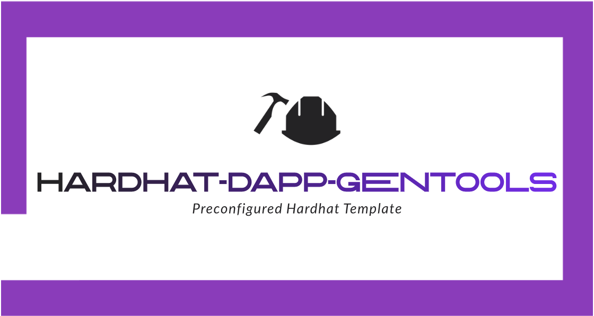

# Hardhat-Dapp-Gentools

This project was created out of needing a quick way to generate a prewired hardhat project connected to the blockchain in order to get the configuration out of the way early.

Configurations: 
hardhat.config.ts
.env

```shell
MNEMONIC=""
PRIVATE_KEY=""
INFURA_API_KEY=""
INFURA_API_SECRET=""
ALCHEMY_API_KEY=""
ETHERSCAN_API_KEY=""
POLYGONSCAN_API_KEY=""
SNOWTRACE_API_KEY=""
```
